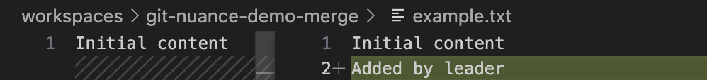
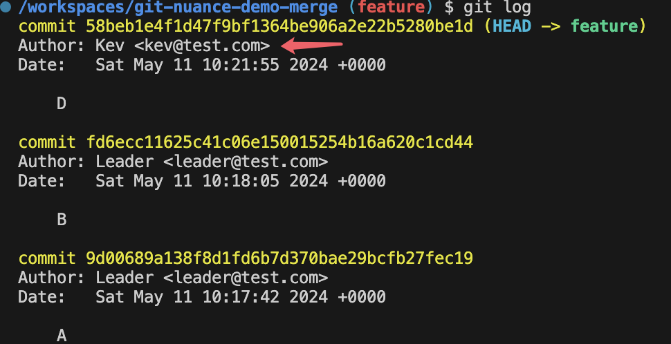
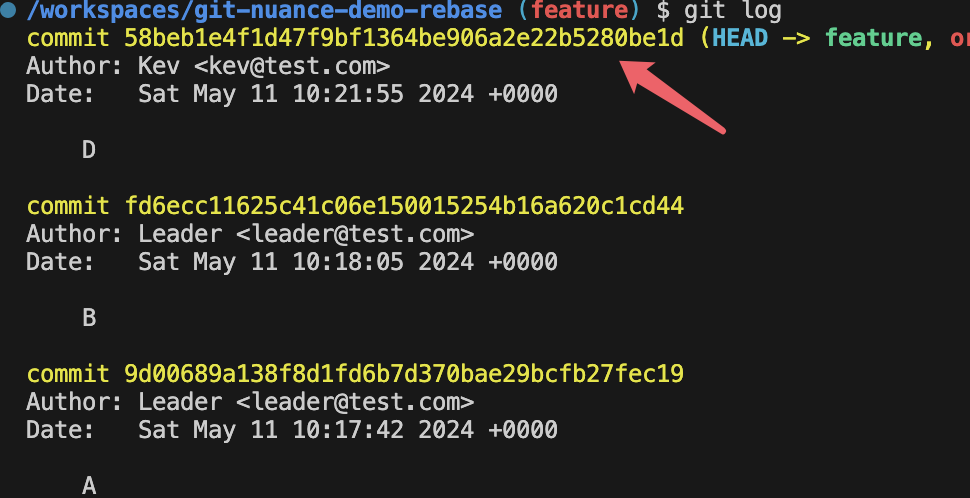
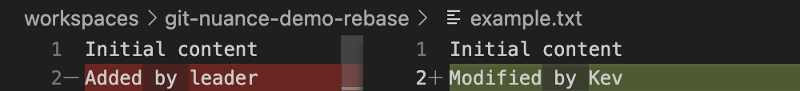
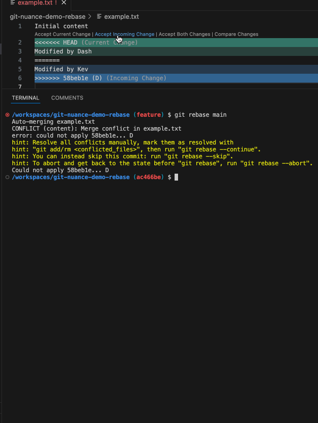

## Scenario Setup

Initiate a Git repository, as well as a `main` branch.

```sh
mkdir git-nuance-demo-merge && \
cd git-nuance-demo-merge && \
git init && \
git branch -M main
```

Create a file.

 ```sh
touch example.txt
 ```

### Commit `A`

Input a first line into `example.txt`

```diff
+Initial content
```


And then make a commit of 'A'.

### Commit `B`

Input a second line into `example.txt`

```diff
Initial content
+Added by leader
```



And then make a commit of 'B'.

### Bseline Commit Graph

Here's the commit graph by now, imagine it as the project baseline.

```css
A---B [main]
```

### Commit `D` (New Branch)

Let's say one of the developers (Kev) needs to develop a new feature, he creates a new branch `feature` based on `main`.

```sh
git checkout -b feature
```

And makes some changes to the second line.

```diff
Initial content
-Added by leader
+Modified by Kev
```


### Commit `C`

During Kev's development, another developer (Dash) merged his feature to branch `main` first, with a commit `C` .

```sh
git checkout main
```

In this commit he also made some changes to the second line.

```diff
Initial content
-Added by leader
+Modified by Dash
```


### Initial Git Commit Graph

Simply put Kev's and Dash's commits above into this graph:

```css
A---B---C [main]
     \
      D [feature]
```

Here are the **Git Histories** on branch `main` and `feature` respectively.

- Git Logs on `main`

  

- Git Logs on `feature`

  

Imagine we need to release the features in brach `feature`, we have 2 options:

- `Merge`: merge `feature` into `main` and release `main` to production environment.
- `Rebase`: Rebase `feature` onto `main`, and release.

Next, we're going to make the 2 options respectively, and find out what are the different consequences of them.

## Option 1: Merge `feature` into `main`

```sh
git checkout main
```

```sh
git merge feature
```


Here's the confict (in line 2).

```txt
Initial content
<<<<<<< HEAD
Modified by Dash
=======
Modified by Kev
>>>>>>> feature
```

And take notes on the console.

```console
/workspaces/git-nuance-demo-merge (main) $ git merge feature
Auto-merging example.txt
CONFLICT (content): Merge conflict in example.txt
Automatic merge failed; fix conflicts and then commit the result.
```

Check it out: **fix conflicts and then commit the result.**

It tells us to both **Fix** and **Commit** so that the conficts can be resolved.

Let's do it by "Accept Incoming Chage", which in this case means accepting branch `feature`'s change.


Do you notice the **new** commit in the Git Logs of `main`?


The details of the new commit (**Merge Commit**).


```diff
Initial content
-Modified by Dash
+Modified by Kev
```

### Graph After Merge

```css
A---B---C---M [main]
     \       /
      D [feature]
```

> `M` represents the new (Merge) commit (after fixing conflict)

## Option 2: Rebase `feature` onto `main`

> Before continuing the rebase process, **Re-do** the **Scenario Setup** with another Git repo

the **Scenario Setup**, our initial commit graph looks as this.

```css
A---B---C [main]
     \
      D [feature]
```

Take a look at brach `feature`.



The commit `D`'s commit ID (hash) is `4fdc6b4...`.

And the changes in this commit.



```diff
Initial content
-Added by leader
+Modified by Kev
```

The commit ID and changes are going to be changed after the rebase, we'll see why.

Now let's start the **Rebase**.

Go to `feature`.

```sh
git checkout feature
```

Rebase it onto `main`.

```sh
git rebase main
```


Here's the confict (also in line 2)

```txt
Initial content
<<<<<<< HEAD
Modified by Dash
=======
Modified by Kev
>>>>>>> 4fdc6b4 (D)
```

The conflict looks **identical** to what we did in the last option (Merge) doesn't it? But the terminal console is different.

```console
/workspaces/git-nuance-demo-rebase (feature) $ git rebase main
Auto-merging example.txt
CONFLICT (content): Merge conflict in example.txt
error: could not apply 4fdc6b4... D
hint: Resolve all conflicts manually, mark them as resolved with
hint: "git add/rm <conflicted_files>", then run "git rebase --continue".
hint: You can instead skip this commit: run "git rebase --skip".
hint: To abort and get back to the state before "git rebase", run "git rebase --abort".
Could not apply 4fdc6b4... D
```

It tells us to **Resolve all conflicts manually**, and continue with `git rebase --continue`.

OK let's follow the guide to resolve the conflict (also by "Accept Incoming Change").



Take some insight into the content after I run `git rebase --continue`.

```txt
D

# Please enter the commit message for your changes. Lines starting
# with '#' will be ignored, and an empty message aborts the commit.
#
# interactive rebase in progress; onto 05cfdd2
# Last command done (1 command done):
#    pick 4fdc6b4 D
# No commands remaining.
# You are currently rebasing branch 'feature' on '05cfdd2'.
#
# Changes to be committed:
# modified:   example.txt
#
```

Here Git offers me an editor to edit the commit message of `D`.

I can make no change and just leave it.

Now the rebase has finished, take a look at the commit history of branch `feature`.


Pay special attention to the commit ID of `D`.

It's now `9e1e9f1...`, remember what was it before the rebase? It was `4fdc6b4...`.

And the changes of this commit.


```diff
Initial content
-Modified by Dash
+Modified by Kev
```

See? The changes are also different to the previous commit `D`, because the commit `D` was **rewritten** in rebase.

> Actually the commit message could also have been modified as well, in the commit editor we saw after ``git rebase --continue`.

### Graph After Rebase

```css
A---B---C [main]
         \
          D' [feature]
```

In this case, we did a "**History Rewrite**", after which `D` disappears and the new `D'` comes out.

This is typical evidence of **why Git Rebase can be Dangerous**.

## Conclusion: Nuance

After fixing the conflicts:

- `Merge`: You need to make a **new commit** indicating how you solved the conflicts, from which your teammates can straightforwardly see how you did that.

- `Rebase`: You **modify the existent commit**, in this modified commit your teammates may see how you solve the conflicts.
