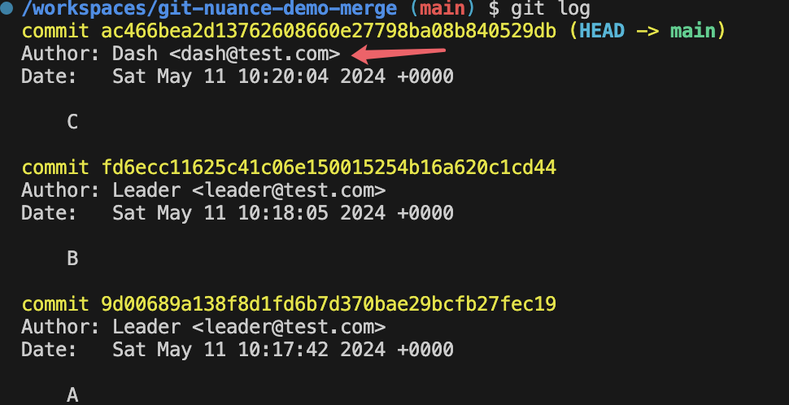
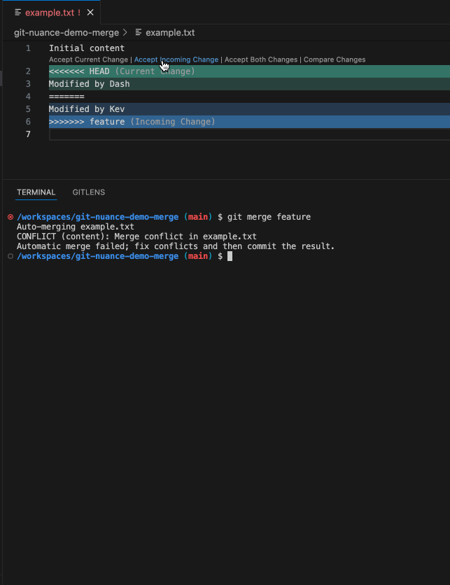
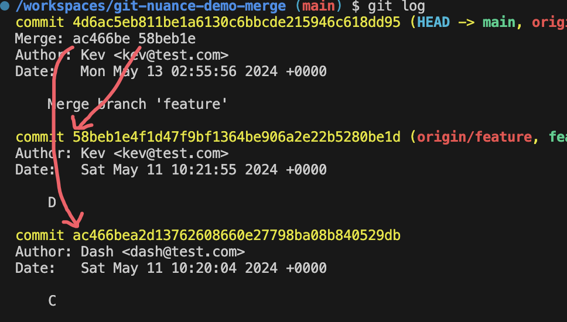
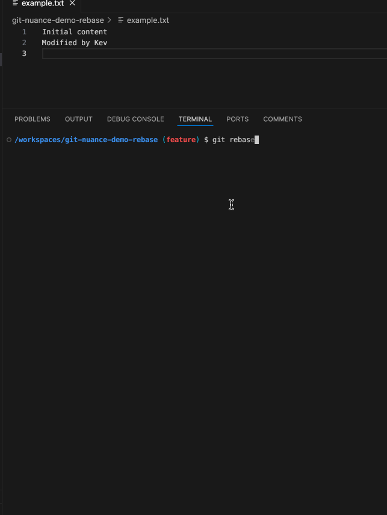
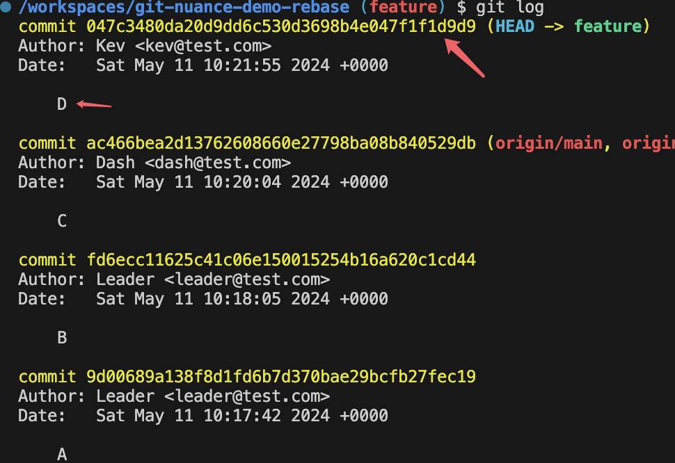

I skip the initial of the Git repository because that is sort of petty, I just assume we have a repo with a `main` brach and without any commit.

## Scenario Setup

Creat a file `example.txt`.

### Commit `A`

input the first line into `example.txt`

```diff
+Initial content
```

And then make a commit of 'A'.


### Commit `B`

input the second line into `example.txt`

```diff
Initial content
+Added by main
```

And then make a commit of 'B'.


### Initial Commit Graph

Here's the commit graph by now.

```css
A---B [main]
```

### Commit `D`

Create a new branch `feature` based on `main`.

```sh
git checkout -b feature
```

Make some change to the second line.

```diff
Initial content
-Added by main
+Modified by feature
```


### Commit `C`

Get back to branch `main`.

```sh
git checkout main
```

And Make some change to the second line too.

```diff
Initial content
-Added by main
+Modified by main
```


### Initial Git Commit Status

Here is what we've done by now on branch `main` and `feature`.

- Git Logs on `main`

  

- Git Logs on `feature`

  

Simply put them into this graph:

```css
A---B---C [main]
     \
      D [feature]
```

Imagine we need to release the features in brach `feature`, we have 2 options:

- `Merge`: merge `feature` into `main` and release `main` to production environment.
- `Rebase`: Rebase `feature` onto `main`, and release.

Next, we're going to make the 2 options respectively, and find out what are the difference consequences of them.

## Option 1: Merge `feature` into `main`

```sh
git checkout main
```

```sh
git merge feature
```


Here's the confict


```txt
Initial content
<<<<<<< HEAD
Modified by main
=======
Modified by feature
>>>>>>> feature
```

And take notes on the console

```console
➜  git-nuance-merge git:(main) git merge feature
Auto-merging example.txt
CONFLICT (content): Merge conflict in example.txt
Automatic merge failed; fix conflicts and then commit the result.
```

Check it out: **fix conflicts and then commit the result.**

It tells us to both **Fix** and **Commit** so that the conficts can be resolved.

Let's do it by "Accept Incoming Chage", which in this case means accepting `feature` brach's change.



Did you notice the new commit in the Git Logs of `main`?


The details of the new commit (**Merge Commit**)


```diff
Initial content
-Modified by main
+Modified by feature
```

### Graph After Merge

```css
A---B---C---M [main]
     \       /
      D [feature]
```

> `M` is the new (Merge) commit after fixing conflict

## Option 2: Rebase `feature` onto `main`

### Re-do the Scenario Setup in another Git repo and return to our initial commit graph

```css
A---B---C [main]
     \
      D [feature]
```

And before continuing the rebase process, take a look at the commit `D`'s commit ID (hash) `89ccb71` on brach `feature`.



And the changes in this commit.

```diff
Initial content
-Added by main
+Modified by feature
```

The commit ID and changes are going to be changed after rebase, we'll see why.

Now let's start the **Rebase**.

Go to `feature`.

```sh
git checkout feature
```

Rebase it onto `main`.

```sh
git rebase base
```



Here's the confict


```txt
Initial content
<<<<<<< HEAD
Modified by main
=======
Modified by feature
>>>>>>> 89ccb71 (D)
```

The conflict looks **identical** to what we did in the last option (Merge) doesn't it? But the terminal console is different.

```console
➜  git-nuance-rebase git:(feature) git rebase main
Auto-merging example.txt
CONFLICT (content): Merge conflict in example.txt
error: could not apply 89ccb71... D
hint: Resolve all conflicts manually, mark them as resolved with
hint: "git add/rm <conflicted_files>", then run "git rebase --continue".
hint: You can instead skip this commit: run "git rebase --skip".
hint: To abort and get back to the state before "git rebase", run "git rebase --abort".
Could not apply 89ccb71... D
```

It tells us to **Resolve all conflicts manually**, and continue with `git rebase --continue`.

OK let's follow the guide to resolve the conflict (also by "Accept Incoming Chage").


Take some insight into the content after I run `git rebase --continue`.

```txt
D

# Please enter the commit message for your changes. Lines starting
# with '#' will be ignored, and an empty message aborts the commit.
#
# interactive rebase in progress; onto 755ac4a
# Last command done (1 command done):
#    pick 89ccb71 D
# No commands remaining.
# You are currently rebasing branch 'feature' on '755ac4a'.
#
# Changes to be committed:
#       modified:   example.txt
#
```

Here Git offers me a editor to edit the commit message of `D`.

I can make no chage and just leave it.

Now the rebase has finished, take a look at the commit history of `feature`.



And the commit ID of `D`.


It's `d512c2f`, remember what was it before rebase? It was `89ccb71`.

And the changes of this commit.

```diff
Initial content
-Modified by main
+Modified by feature
```

See? The changes are also different to the previous commit `D`.

### Graph After Rebase

```css
A---B---C [main]
         \
          D' [feature]
```

## Nuance

After fix the conflicts:

- `Merge`: You need to make a **new commit** indicating how you solve the conflicts, from which your teammates can straightforwardly see how you did that.

- `Rebase`: You **modify the existent commit**, in this modified commit your teammates may see how you solve the conflicts.
